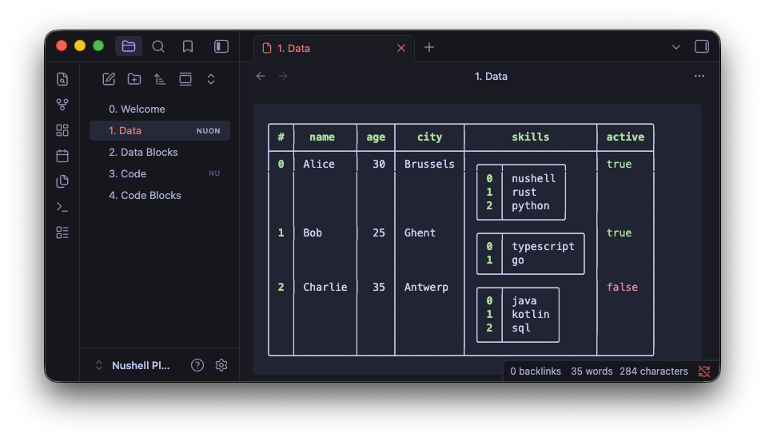
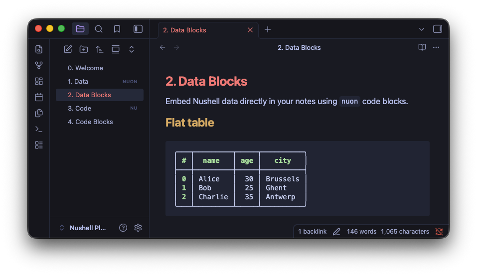
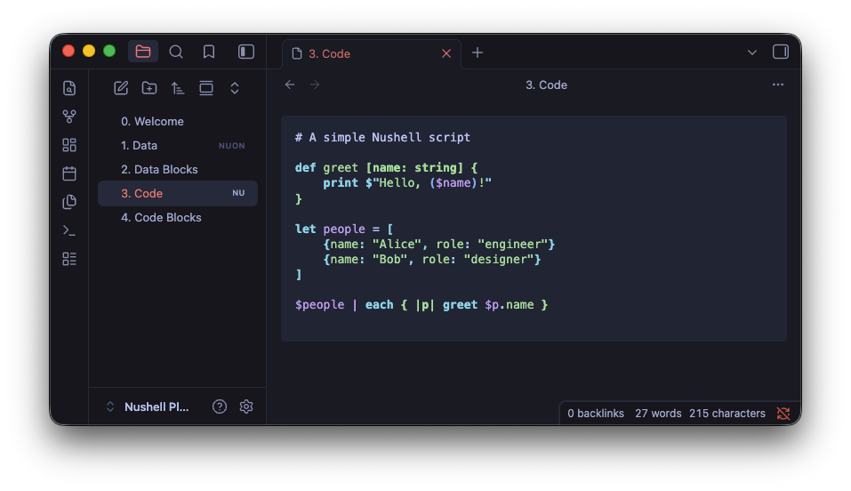
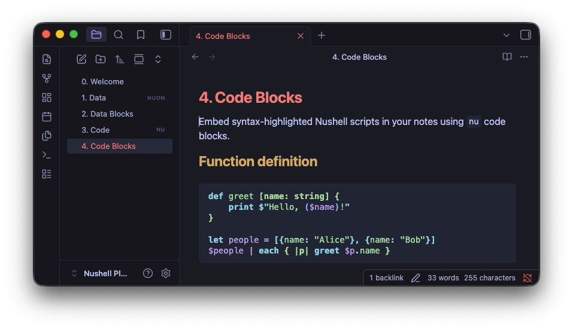

# Nushell for Obsidian

Render Nushell data files (`.nuon`) and syntax-highlight Nushell scripts (`.nu`) using the local Nushell installation.









## Features

- **`.nuon` file viewer** -- open `.nuon` files directly in Obsidian and see them rendered as colored Nushell tables with nested records, lists, and type-based coloring
- **`.nu` file viewer** -- open `.nu` scripts with syntax highlighting powered by Nushell's own `nu-highlight`
- **`nuon` code blocks** -- embed Nushell data inline in your notes
- **`nu` code blocks** -- embed syntax-highlighted Nushell scripts in your notes
- **Settings panel** -- configure date/time format (with presets), filesize units, and boolean/datetime/filesize colors
- **Graceful fallback** -- if Nushell is not installed, files are displayed as raw text with a warning

### Code block examples

````markdown
```nuon
[[name, age, city]; [Alice, 30, Brussels], [Bob, 25, Ghent]]
```

```nu
def greet [name: string] {
    print $"Hello, ($name)!"
}
```
````

## Requirements

- [Nushell](https://www.nushell.sh/) must be installed locally (v0.102+ recommended for color support)
- Desktop only (requires shell access)

## Installation

### From Obsidian

1. Open Settings > Community plugins
2. Search for "Nushell"
3. Install and enable

### Manual

1. Download `main.js`, `manifest.json`, and `styles.css` from the [latest release](https://github.com/ChristianLemer/obsidian-nushell/releases)
2. Create a folder `<vault>/.obsidian/plugins/obsidian-nushell/`
3. Copy the files into that folder
4. Enable the plugin in Settings > Community plugins

## Settings

| Setting          | Description                                                                     |
| ---------------- | ------------------------------------------------------------------------------- |
| Date/time format | strftime format string with presets, or leave empty for natural ("2 days ago")  |
| Date/time color  | Color for datetime values                                                       |
| Filesize unit    | Metric (kB, MB) or binary (KiB, MiB)                                            |
| Filesize color   | Color for filesize values                                                       |
| True/False color | Separate colors for boolean values                                              |

## Development

```bash
npm install
npm run dev    # watch mode
npm run build  # production build
```

A `Nushell Plugin Playground` folder is included as a test vault. To open it:

```nu
use local; local obsidian open
```
